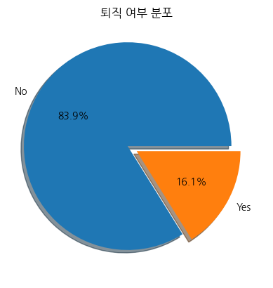
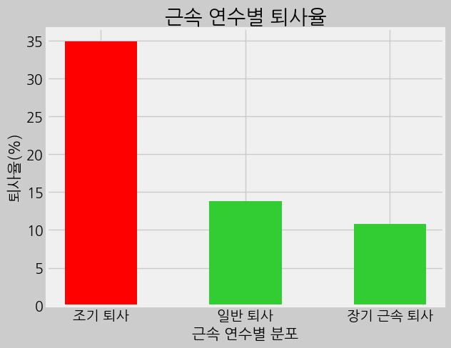
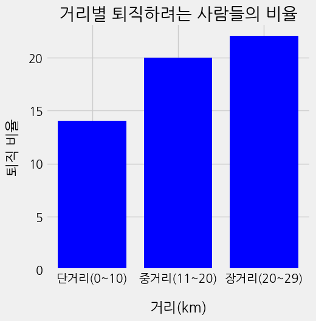
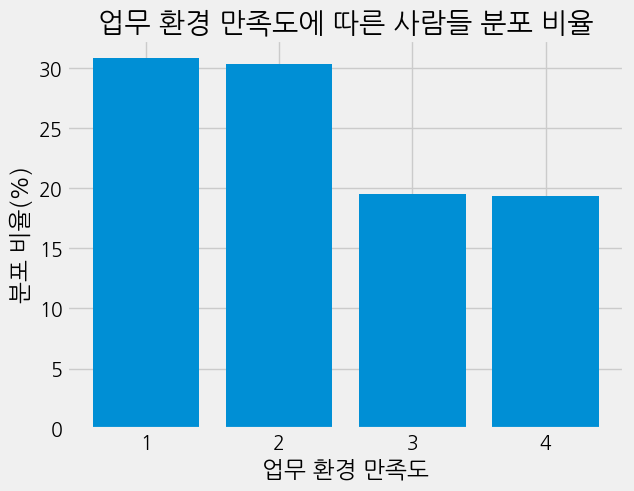
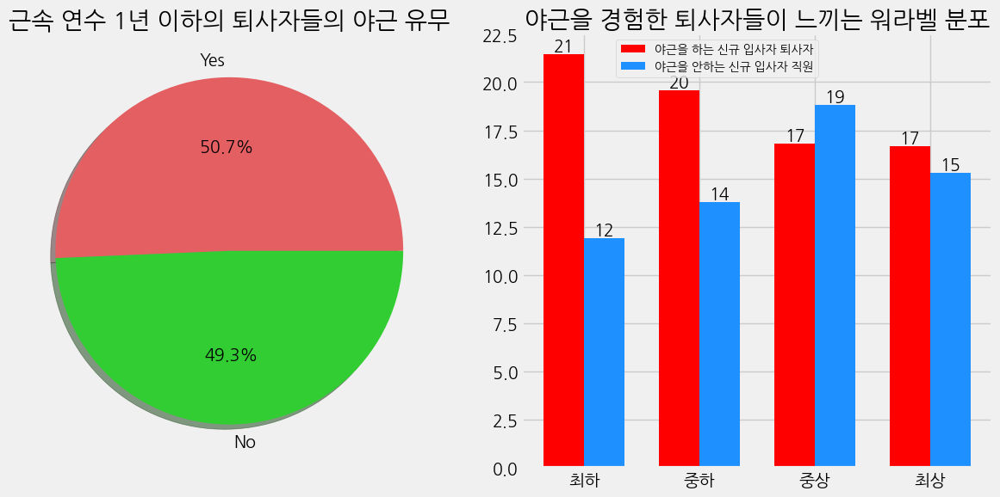

퇴사 요인 분석
==============

요약
--------------------------------------
1. 기본 정보
- 개인 프로젝트(기여도 100%)
***
2. 프로젝트 진행 배경
- 그로스 해킹을 통해 a/b테스트를 알게 되었습니다.
- a/b테스트 지식을 내재화하고자 진행하였습니다.
***


3. 데이터셋

470명의 35가지 요인이 존재하는 데이터셋​

명목형 데이터 : 직원 ID(PK), 업무 분야, 전공, 성별, 업무 종류, 결혼 여부, 규정 외 노동시간​

순서형 데이터 :  출장 빈도, 학력, 업무환경 만족도, 업무 참여도, 업무 수준. 업무 만족도, 업무 성과, 대인관게 만족도, 스톡옵션 정도, 워라벨 정도​

수치형 데이터 : 나이, 집과의 거리, 시간 대비 급여 수준, 일 대비 급여 수준, 월 대비 급여 수준, 월 소득, 급여의 증가분 백분율, 일한 회사의 수, 경력 기간, 교육 시간, 근속 연수, 현재 역할의 연수, 마지막 승진, 현재 관리자와 함께 보낸 시간​

이진 데이터 : 퇴직 여부
--------
***
### 1. 문제 정의
   
- 직원들 입장에서 퇴사는 이직 혹은 기업의 불만족 등 다양한 이유로 자유롭게 선택할 수 있습니다.​​
- 기업 입장에서 많은 신입의 퇴사로 인한 지속적인 채용에 따른 비용은 부담이 되기도 하고 회사의 업무 진행과 업무 효율에 차질이 생기게 됩니다. 이로 인해 기업의 생산력은 감소하게 됩니다.
- 높은 퇴사율은 기업 이미지에도 영향을 끼치게 됩니다.
- 이러한 기업의 문제 해결에 도움이 되기 위해 퇴사자들의 퇴사 원인을 파악하여, 퇴사율을 낮추기 위한 해결 방안을 제시하기 위해서입니다.​

***
### 2. 문제 인식
- 기업의 평균 퇴사율은 11.8%(2021년 기준)이지만 이 기업의 경우 퇴사율이 16.1%로 평균보다 4.1% 높은 것을 확인할 수 있습니다. 
    - 기업 평균 퇴사율 출처 : [매일 일보](https://www.m-i.kr/news/articleView.html?idxno=886595)
- 조기(0\~1년차) 퇴사자의 비율이 일반(2\~4년) 퇴사자의 2배, 장기(5+@년) 퇴사자의 3배보다 많았습니다.


-------

### 3. EDA
- EDA를 진행한 결과 아래와 같은 사실을 파악했습니다.

    - 조기(0\~1년차) 퇴사자의 비율이 일반(2\~4년) 퇴사자의 2배, 장기(5+@년) 퇴사자의 3배보다 많았습니다.

    - 회사외 집과의 거리가 멀수록 퇴사자의 비율이 높은 것을 확인 하였습니다.

    - 퇴사자들이 느낀 업무 환경이 대부분 불만족스러웠다고 하였습니다.

    - 신입 사원의 절반이 야근을 하는 것을 알 수 있습니다.
    - 신입 사원의 경우 야근을 경험하는 사원들이 느끼는 워라벨이 야근을 안하는 신규 입사자의 워라벨보다 낮았습니다.

------ 


### 4. 분석

1. ```조기 퇴사자의 워라벨이 보장되어지지 않아 퇴사를 결정하게 되는것이 아닐까```라는 가설을 세우고 분석을 진행했습니다
  - 비교 지표 : 조기 퇴사자 vs 퇴사 안한 직원들
  - 관심 지표 : 워라벨 정도, 규정외 노동시간
  - 분석 기법 : 카이제곱 검정
    - 선택 이유 : 야근 여부에 따라 퇴직하는 사람들과 퇴직을 하지 않는 사람들의 평균을 비교하기 위해서 입니다.
근속 연수가 4년 이하 직원의 퇴사 비율이 전체 퇴사자들 중 43% 입니다.​

단기 근속 퇴사자들 중 절반 이상이 야근을 경험했습니다​

단기 근속 퇴사자들은 야근을 하면 워라벨이 보장받지 못한다고 생각하고 퇴사의 주요 원인이라고 판단됩니다.​

야근을 안하는 직원들은 워라벨이 보장받는다고 생각합니다.​

----------

### 6. 결론
업무 환경 개선 제안 : 업무에 몰입이 가능한 환경으로 개선합니다. 향상된 업무 몰입으로 주어진 업무를 업무 시간 내에 처리할 수 있도록 하여 규정 외 노동시간에 업무를 줄이는 방안

유연근무제 제안 : 근무 시간과 장소를 직원 스스로 정하게 합니다. 집과의 거리가 먼 직원들에게도 출퇴근 부담을 줄이고 업무 효율 및 만족도를 향상시켜 워라벨을 보장하는 방안

-----

### 7. 리뷰